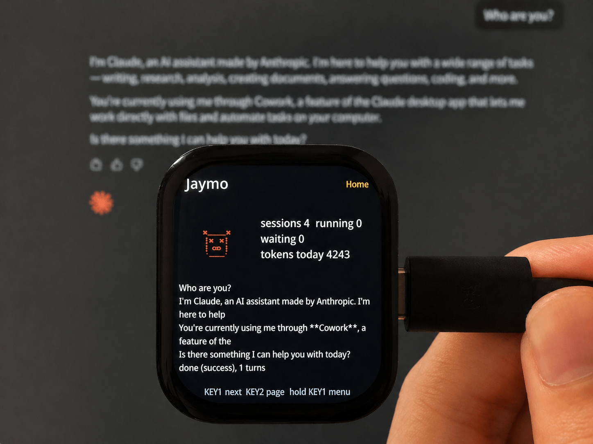

# Claude Desktop Buddy for SiFli



Firmware port of `anthropics/claude-desktop-buddy` for the SiFli SF32LB52
platform, currently targeting the Huangshan Pi `sf32lb52-lchspi-ulp` HCPU
project.

The goal is to make the board behave like a Claude Hardware Buddy over BLE:
Claude Desktop connects through a Nordic UART Service compatible profile, sends
newline-delimited JSON snapshots and commands, and the device renders status,
permission prompts, pairing state, and runtime character assets on the local
display.

This is an experimental embedded port, not an official Anthropic product.

## Current Scope

- SiFli SDK based firmware project under `app/project`
- BLE Nordic UART Service compatibility for Claude Desktop discovery
- encrypted BLE bonding with passkey display support
- bounded NDJSON line assembly and command parsing
- status, identity, time sync, permission, reset, species, and character package
  protocol handling
- LVGL v8 UI for the 390x450 Huangshan Pi display
- staged LittleFS runtime character storage with manifest validation
- host-side tests for portable core and protocol behavior
- GitHub Actions firmware build using the same commands documented below

## Documentation

- [Architecture](docs/architecture.md) explains the firmware layers, data flow,
  platform boundaries, UI model, and storage strategy.
- [BLE Protocol](docs/protocol.md) documents the NUS profile, NDJSON messages,
  commands, permission decisions, and character package transfer rules.
- [Development](docs/development.md) covers setup, tests, firmware build, and
  contribution expectations.

## Repository Layout

```text
.
|-- SiFli-SDK/          # SiFli SDK submodule
|-- app/
|   |-- project/        # SCons project, board config, linker script, ptab
|   `-- src/            # firmware source
|-- docs/               # public documentation
|-- tests/host/         # host tests for portable modules
`-- .github/workflows/  # CI build
```

## Setup

Clone with submodules, or initialize them after cloning:

```bash
git submodule update --init --recursive
```

Install the SiFli SDK toolchain profile:

```bash
./SiFli-SDK/install.sh
```

## Build

Use the same firmware build flow as CI:

```bash
cd app/project
source ../../SiFli-SDK/export.sh
scons --board=sf32lb52-lchspi-ulp -j2
```

To inspect the generated firmware size from the repository root:

```bash
source SiFli-SDK/export.sh
arm-none-eabi-size app/project/build_sf32lb52-lchspi-ulp_hcpu/main.elf
```

## Test

Run host tests from the repository root:

```bash
./tests/host/run_host_tests.sh
```

These tests cover the portable C++ core, JSON line assembler, protocol command
handling, and ASCII character selection logic. Hardware BLE, display, and
filesystem behavior still need board-level validation.

## Development Notes

- Keep protocol and application state portable under `app/src/core`.
- Keep SiFli SDK, RT-Thread, BLE, LVGL, and filesystem calls behind C ABI or
  platform-facing modules.
- Do not persist raw Claude protocol payloads in release builds.
- Use Conventional Commits for changes.
- Avoid committing generated firmware output under `app/project/build_*`.

## License

This repository is licensed under the Apache License, Version 2.0. See
[LICENSE](LICENSE).

The `SiFli-SDK` submodule and bundled third-party components retain their own
licenses.
