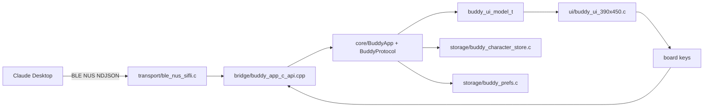

# Architecture

This project ports `anthropics/claude-desktop-buddy` to the SiFli SF32LB52
platform. The current target board is Huangshan Pi
`sf32lb52-lchspi-ulp`, using the HCPU firmware project under `app/project`.

The firmware is organized so that Claude protocol handling and user-visible
state remain portable, while SiFli SDK, RT-Thread, BLE, LVGL, and storage
details stay behind narrow platform boundaries.

## Layer Model

The application uses C++ for bounded domain logic and C for SDK-facing code:

- `app/src/core/` owns line assembly, JSON protocol parsing, snapshots,
  permission decisions, identity settings, species selection, time sync, and
  character package validation.
- `app/src/bridge/` exposes a small C ABI so RT-Thread, LVGL callbacks, and
  SiFli BLE callbacks do not depend on C++ types.
- `app/src/transport/` maps Claude Desktop's expected Nordic UART Service
  profile onto SiFli BLE GATT APIs.
- `app/src/ui/` renders the current model with LVGL and translates board
  buttons into application actions.
- `app/src/storage/` stores preferences and pushed character assets using the
  platform filesystem and key-value facilities.
- `tests/host/` builds portable core tests outside the firmware image.

## Runtime Flow

1. `main.c` initializes charger detection, the Buddy application core, BLE NUS,
   and the LVGL UI.
2. BLE writes are received by `ble_nus_sifli.c` and forwarded through
   `buddy_app_on_ble_rx`.
3. `JsonLineAssembler` buffers UTF-8 NDJSON until a full line is available.
   Oversized lines are dropped and counted instead of growing buffers.
4. `BuddyProtocol` parses JSON, updates the current snapshot, handles commands,
   and emits newline-delimited JSON acknowledgements through the transport hook.
5. `buddy_app_get_ui_model` converts runtime state into a plain C UI model.
6. The UI refresh loop renders the home, approval, pairing, info, and settings
   views from that model.

The firmware keeps LVGL operations on the UI path. BLE callbacks do minimal
work and pass data into the application boundary instead of parsing JSON inside
the transport layer.

## State Model

The core state tracks:

- connection and encryption status
- current device name and owner
- Claude session counters, token counters, and recent summary entries
- active permission prompt id, tool name, and short hint
- current built-in ASCII species or runtime GIF character sentinel
- time sync metadata
- character package transfer progress

The UI derives the visual persona from this state:

- prompt pending: attention view
- disconnected or stale heartbeat: sleep/offline view
- at least one running task: busy view
- otherwise: idle view

Permission actions are only sent when the current prompt id still matches the
active prompt. This avoids sending a stale approval after Claude has moved on.

## BLE Boundary

The BLE transport advertises as `Claude-XXXX` and exposes the canonical Nordic
UART Service UUIDs expected by Claude Desktop. It supports encrypted
write/notify characteristics and DisplayOnly passkey bonding through the SiFli
connection manager.

Transport responsibilities are intentionally small:

- advertise the service and device name
- track connection, encryption, MTU, and notification state
- forward RX bytes to the core
- fragment TX notifications to fit the negotiated MTU
- surface pairing passkeys to the application/UI
- clear bonds when requested

Protocol details are documented in [protocol.md](protocol.md).

## UI Boundary

The UI is currently implemented as an LVGL v8 frontend for the 390x450
Huangshan Pi display. The implementation still avoids hard-coding business
state into LVGL objects:

- `buddy_ui_model_t` is the only data contract from the core to the UI.
- board key handling produces semantic actions such as approve, deny, menu,
  and selection.
- settings, info, pairing, approval, and home views are rendered from the same
  application model.
- CJK font fallback is enabled for labels that may show user-provided text.

The current frontend is board-specific, but the model boundary allows another
LVGL screen layout or another display target to be added without changing the
protocol parser.

## Storage Boundary

Preferences and character files are separated:

- identity and UI settings use platform preference storage
- character packages are staged under `/characters/.incoming`
- a validated package is committed to `/characters/active`
- failed or aborted transfers remove incoming data before returning to the
  previous active character

Character package writes are staged, size-checked, path-checked, and manifest
validated before activation. Incoming file paths are flat filenames only; hidden
paths, absolute paths, `.`/`..`, and directory separators are rejected.

The board filesystem region is limited, so the firmware checks available space
before accepting a package and keeps enough margin to avoid damaging the active
character on failed updates.

## Memory And Resource Strategy

The target has constrained HCPU RAM, so hot paths avoid unbounded allocation:

- NDJSON lines have a fixed maximum size.
- snapshot strings and prompt fields are copied into fixed-size buffers.
- BLE notifications are sent in small MTU-aware chunks.
- LVGL uses partial framebuffer configuration from the SiFli project settings.
- runtime GIF assets are loaded from the filesystem and should keep large image
  buffers out of default HCPU heap where possible.

Host tests cover the portable protocol and application logic. Firmware builds
are performed through the SiFli SDK SCons flow used by CI.

## Porting Notes

To port this project to another SiFli board, start by keeping the core and
bridge untouched, then adapt:

- board selection and memory layout under `app/project`
- display and input handling under `app/src/ui`
- BLE platform glue under `app/src/transport`
- filesystem region and storage mounting under `app/src/storage`
- power, charger, and other board-specific platform helpers

The intended dependency direction is always inward: platform code calls the C
ABI, and the core depends only on hook interfaces, not on SiFli SDK headers.
